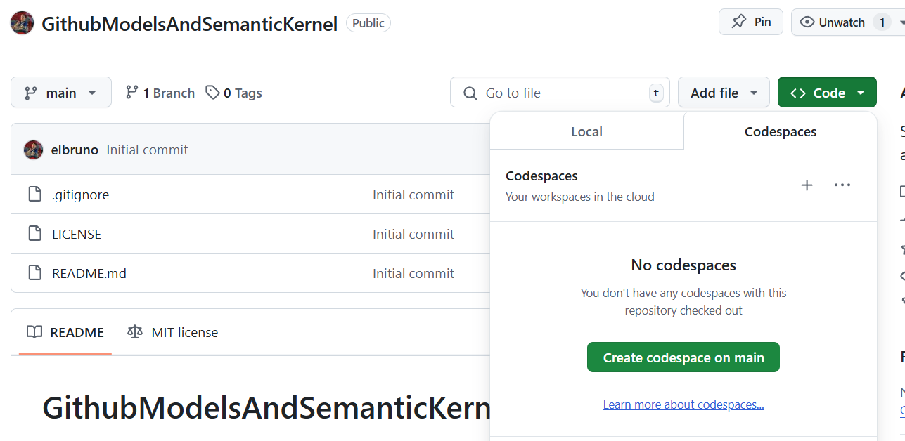
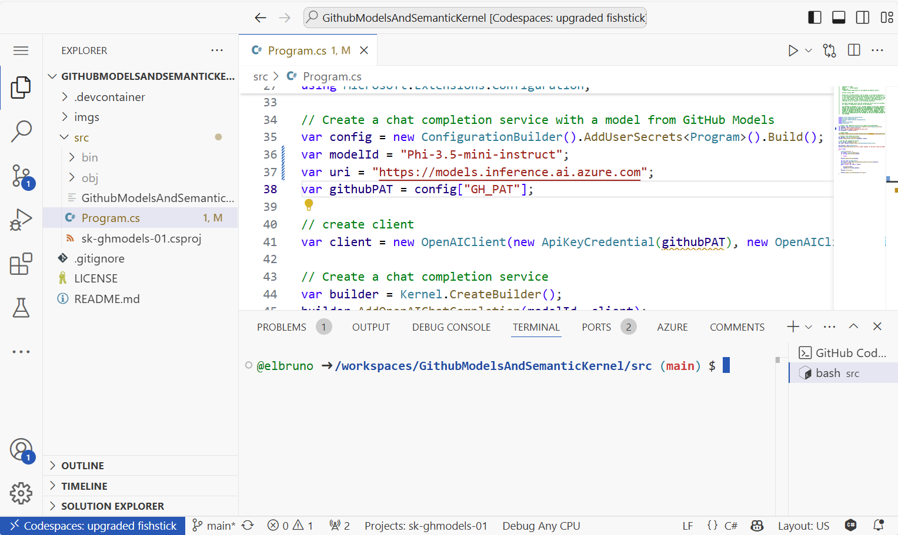
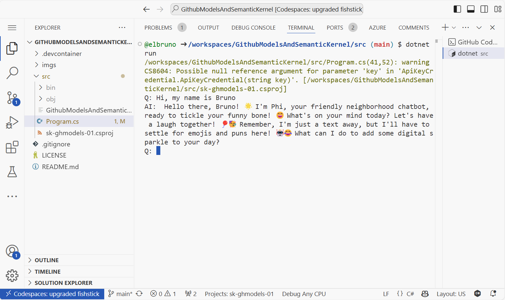

# GitHub Models and Semantic Kernel Sample

[](/LICENSE)
[](https://twitter.com/elbruno)


This project is designed to be opened in GitHub Codespaces as an easy way for anyone to try out the GitHub Models entirely in the browser.

1. Create a new  Codespace using the `Code` button at the top of the repository.


1. Generate a [GitHub Personal Access Token (PAT)](https://github.com/settings/tokens)

1. Open terminal, and navigate to the the src folder.

    ```bash
    cd src
    ```

1. Save the PAT as a User Secret with the following command:

    ```bash
    dotnet user-secrets init
    dotnet user-secrets set "GH_PAT" "< PAT >"
    ```

1. Select a model from the [GitHub Model Marketplace](https://github.com/marketplace/models). For the current demo, we will use [Phi-3.5-mini instruct (128k)](https://github.com/marketplace/models/azureml/Phi-3-5-mini-instruct)

1. Edit the file [program.cs](./src/Program.cs). Complete the following information:

    - ModelId
    - Uri Endpoint

    Your code should look like this:

    

1. In the terminal, run the project with the command:

    ```bash
    dotnet run
    ```

    The app should run a chat using the selected mode in the terminal.
    

## Video Tutorials

If you want to learn more about how to use this repo, check the following videos:

### GitHub Models and Semantic Kernel

[](https://youtu.be/tVgQChnPqc0)

## References

- [GitHub Models](https://github.com/marketplace/models)
- [GitHub Models - Rate Limits](https://docs.github.com/en/github-models/prototyping-with-ai-models#rate-limits)
- [Semantic Kernel main repository](https://github.com/microsoft/semantic-kernel)
- [Phi-3 Cookbook](https://aka.ms/Phi-3CookBook)

## Author

👤 **Bruno Capuano**

* Website: https://elbruno.com
* Twitter: [@elbruno](https://twitter.com/elbruno)
* Github: [@elbruno](https://github.com/elbruno)
* LinkedIn: [@elbruno](https://linkedin.com/in/elbruno)

## 🤝 Contributing

Contributions, issues and feature requests are welcome!

Feel free to check [issues page](https://github.com/elbruno/phi3-labs//issues).

## Show your support

Give a ⭐️ if this project helped you!


## 📝 License

Copyright &copy; 2024 [Bruno Capuano](https://github.com/elbruno).

This project is [MIT](/LICENSE) licensed.

***
